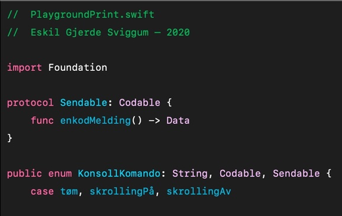
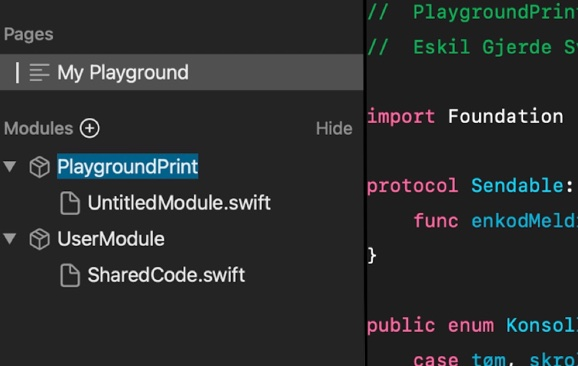

# PlaygroundConsole
A lightweight console for Swift Playgrounds — which does not expense performance. 

##Instructions

###Copy code

[Code](./PlaygroundKonsoll/Kontrollerar/Instructions/Resources/pprint.txt) 
###Paste to a module in “Playgrounds”

###Import & `pprint`
