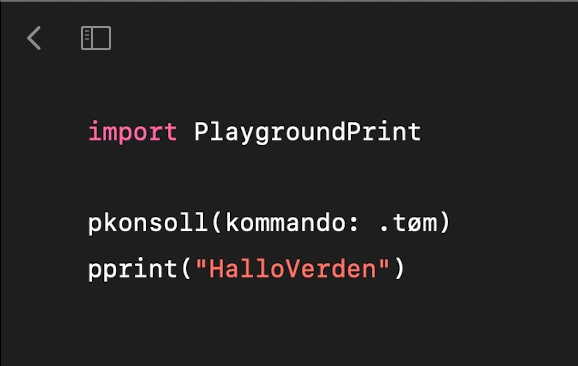

# PlaygroundConsole
A lightweight console for Swift Playgrounds — which does not expense performance. 

## Instructions

### Copy code
[Code](./PlaygroundKonsoll/Kontrollerar/Instructions/Resources/pprint.txt) 

### Paste to a module in “Playgrounds”

### Import & `pprint`

